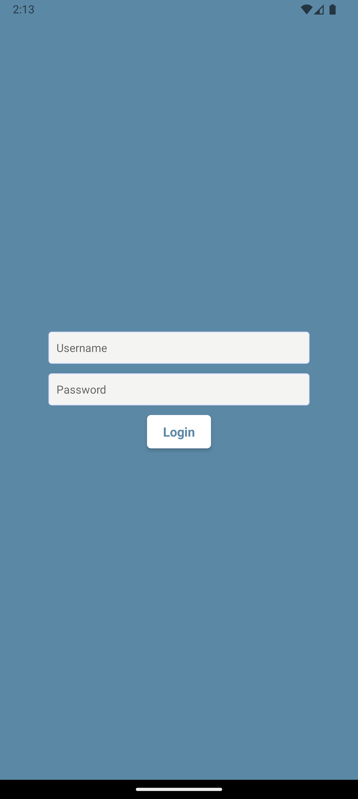
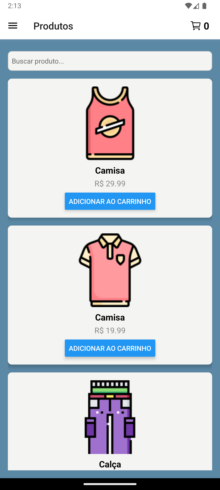
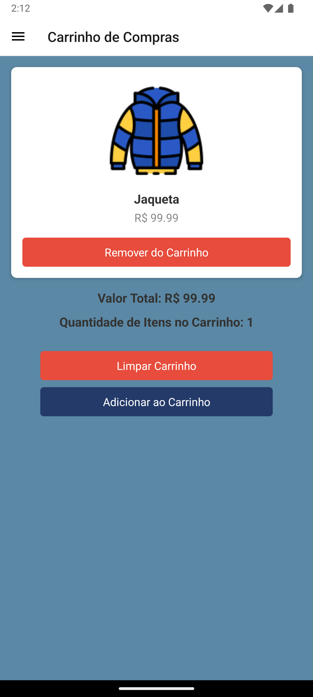

# 📦 Product Page

Bem-vindo ao **Product Page app Ecommerce**! Este é um aplicativo React Native que exibe uma lista de produtos com funcionalidade de pesquisa e rolagem infinita para carregar mais itens. Os usuários podem adicionar produtos ao carrinho e navegar facilmente pela interface. Além disso, o aplicativo possui uma aba de login funcional.

## 🚀 Funcionalidades

- **Login**: Acesse a conta usando o usuário `Brian` e a senha `1234`.
- **Pesquisa de Produtos**: Filtre produtos usando a barra de pesquisa.
- **Rolagem Infinita**: Carregue mais produtos à medida que você rola para baixo na lista.
- **Adicionar ao Carrinho**: Adicione itens ao seu carrinho de compras com um simples toque.
- **Carrinho de Compras**: Visualize e gerencie os itens no seu carrinho.

## Tela de Login 🔐

 Acesse a conta usando o usuário `Brian` e a senha `1234`

## 👕 Tela de Produtos

Filtre produtos usando a barra de pesquisa. Carregue mais produtos à medida que você rola para baixo na lista.

## 🛒 Tela do Carrinho de Compras

A tela do carrinho de compras exibe informações sobre os itens selecionados, valor total e opções para limpar o carrinho ou adicionar novos itens. 

### Estrutura da Tela do Carrinho de Compras

- **Valor Total**: Exibe o valor total dos itens no carrinho.
- **Quantidade de Itens**: Mostra a quantidade total de itens.
- **Botões**: Opções para limpar o carrinho ou adicionar um novo item

## 📱 Tecnologias Utilizadas

- [React Native](https://reactnative.dev/) - Biblioteca para construir aplicativos móveis.
- [Context API](https://reactjs.org/docs/context.html) - Gerenciamento de estado global para autenticação e carrinho.
- [FlatList](https://reactnative.dev/docs/flatlist) - Componente otimizado para renderização de listas.

# 💻 Como Usar

  1.   Abra o aplicativo no seu dispositivo ou em um emulador.
  2.   Faça login usando o usuário `Brian` e a senha `1234`.
  3.   Use a barra de pesquisa para encontrar produtos específicos.
  4.   Role para baixo para carregar mais produtos.
  5.   Clique em "Adicionar ao Carrinho" para adicionar um item ao seu carrinho de compras.
  6.   Acesse a tela do carrinho de compras para visualizar os itens e gerenciar suas compras.

🎨 Estilos

A interface é estilizada com um esquema de cores agradável, proporcionando uma experiência de usuário intuitiva e responsiva.
